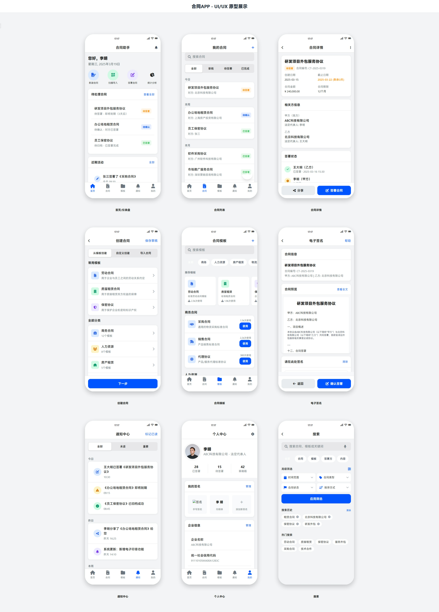
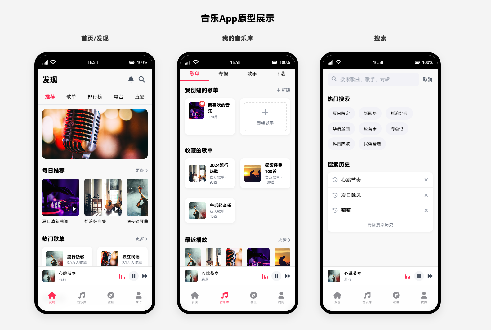
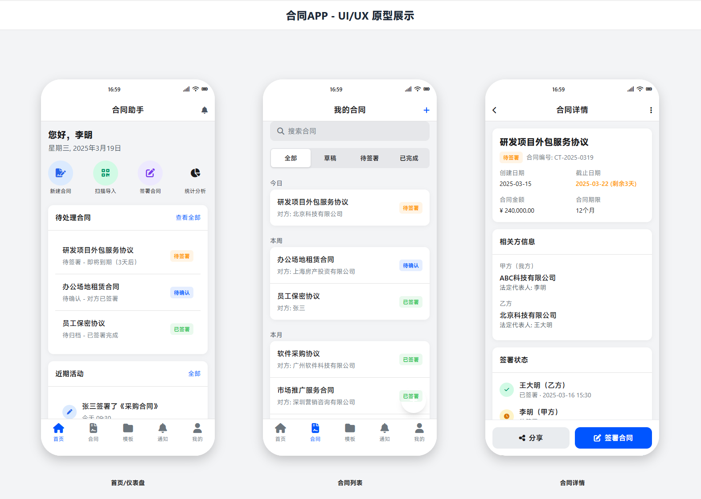
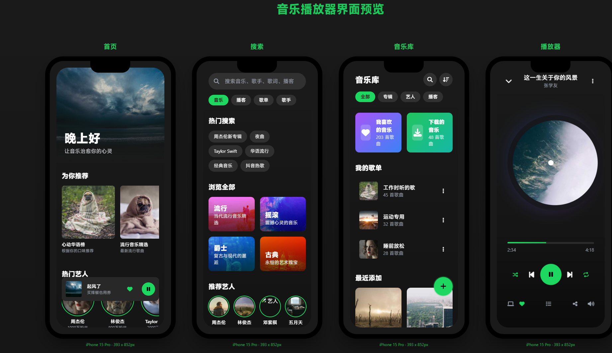
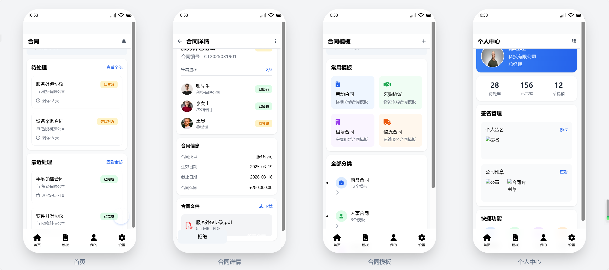
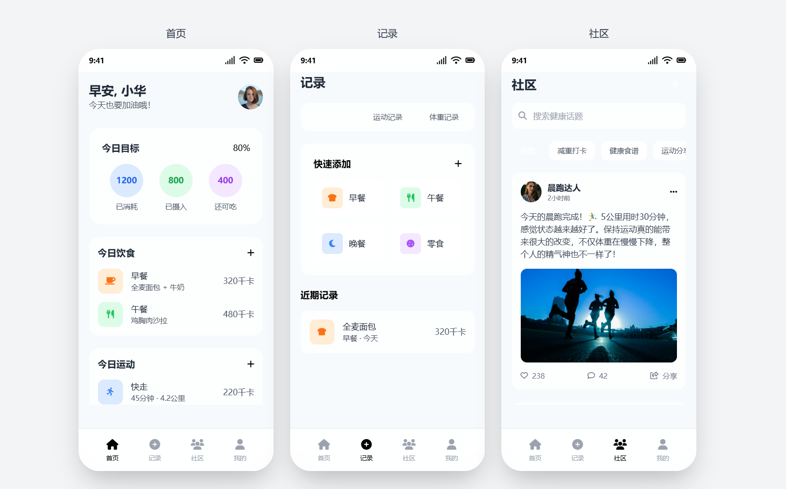

# 🎨 Claude - AI-Powered UI/UX Design Workshop

> This project leverages **Claude 3.7/3.5** and the **Cursor** tool to generate high-fidelity UI code, exploring industrial practices of AI-assisted design.

[中文版](./README_zh-CN.md.md)



## 🌟 Core Value

### 🚀 Product Features
- **Highlights with AI Efficiency**
  - Natural language-driven design iterations
  - Atomic styling system with Tailwind CSS
  - Seamless workflow integration with Figma/Pixso
  
  

## 🛠 Technology Overview
### Tech Stack Matrix
| Category     | Technologies                      |
|--------------|----------------------------------|
| **AI Engine**| Claude 3.7 / Claude 3.5         |
| **Dev Tools**| Cursor / Cline/Trae               |
| **Frontend** | HTML5 + Tailwind CSS             |
| **Design**   | Figma (HTML plugin) / Pixso     |

## 🎯 Generated Examples
| Example Name | Generated Effect | Name          |
|--------------|------------------|---------------|
| project01    |  | Music app     |
| project02    |  | Contract app  |
| project03    |  | Music app     |
| project04    |  | Contract app  |
| project05    |  | Health app    |

### Importing Design Assets
```tip
💡 The generated results can be directly imported via Figma's HTML plugin. Recommendations:
1. Create a 375x812 canvas in Figma (iPhone 15 Pro size)
2. Use "Convert to Path" for text layers
3. Apply community plugins like "Glassmorphism" to enhance visual quality
```
## 🤖 prompt
```
You are a seasoned full-stack engineer. Referencing ui_ux_design, design an "Idle App", simulating the requirements and information architecture as proposed by a product manager. Conceive the functional requirements and interfaces yourself, then design the UI/UX.

- Product Interface Planning: As a product manager, define key interfaces to ensure a rational information architecture.
- User Experience Analysis: Analyze the primary functions and user needs of this app first, determining the core interaction logic.
- High-Fidelity UI Design: As a UI designer, design interfaces that closely follow iOS/Android design guidelines, using modern UI elements for a pleasant visual experience.
- HTML Prototype Implementation: Use HTML + Tailwind CSS (or Bootstrap) to generate all prototype interfaces, and use FontAwesome (or other open-source UI components) to make the interface more exquisite and closer to the real app design. Split code files to maintain clarity (pay attention to avoid using 'list-item' as it is a Tailwind attribute).
- Each interface should be stored as an independent HTML file, such as home.html, profile.html, settings.html, etc.
- index.html serves as the main entry point; instead of directly writing all interface HTML codes, iframe should be used to embed these HTML snippets, displaying all pages directly on the index page without redirecting links.
- Enhance Realism: The interface size should simulate the iPhone 15 Pro, with rounded corners to make it look more like a real mobile interface.
- Use real UI images rather than placeholder images (choose from Unsplash, Pexels, Apple's official UI resources, etc.).
- Add a top status bar (simulating the iOS status bar) and include an app navigation bar (similar to the iOS bottom Tab Bar).
- Please generate complete HTML code according to the above requirements, ensuring it can be used for actual development.
- For scrollable pages, do not display scroll bars.
- If a single page has a large amount of code, it can be written in batches.
- Aim for a high-quality feel (utilize visual effects like Glassmorphism), adhere to design specifications, and focus on UI details.
- Use sequential thinking for step-by-step analysis.
```
**中文版**

```
你是一位资深全栈工程师，参考 ui_ux_design 设计一个【闲置app】，模拟产品经理提出需求和信息架构，请自己构思好功能需求和界面，然后设计 UI/UX。

- 产品界面规划：作为产品经理，定义关键界面，确保信息架构合理。
- 用户体验分析：先分析这个 App 的主要功能和用户需求，确定核心交互逻辑。
- 高保真 UI 设计：作为 UI 设计师，设计贴近真实 iOS/Android 设计规范的界面，使用现代化的 UI 元素，使其具有良好的视觉体验。
- HTML 原型实现：使用 HTML + Tailwind CSS（或 Bootstrap）生成所有原型界面，并使用 FontAwesome（或其他开源 UI 组件）让界面更加精美、接近真实的 App 设计。拆分代码文件，保持结构清晰（-注意 list-item 是Tailwind 的属性，避开这个className）。
- 每个界面应作为独立的 HTML 文件存放，例如 home.html、profile.html、settings.html 等。
- index.html 作为主入口，不直接写入所有界面的 HTML 代码，而是使用 iframe 的方式嵌入这些 HTML 片段，并将所有页面直接平铺展示在 index 页面中，而不是跳转链接。
- 真实感增强：界面尺寸应模拟 iPhone 15 Pro，并让界面圆角化，使其更像真实的手机界面。  
- 使用真实的 UI 图片，而非占位符图片（可从 Unsplash、Pexels、Apple 官方 UI 资源中选择）。  
- 添加顶部状态栏（模拟 iOS 状态栏），并包含 App 导航栏（类似 iOS 底部 Tab Bar）。
- 请按照以上要求生成完整的 HTML 代码，并确保其可用于实际开发。
- 可以滑动的页面不要显示滚动条
- 如果单个页面代码量大，可以分次写入
- 要高级有质感（运用玻璃拟态等视觉效果），遵守设计规范，注重UI细节
- 使用 sequentialthinking 逐步分析
```

## 📜 License
This project is licensed under the [MIT License](LICENSE)